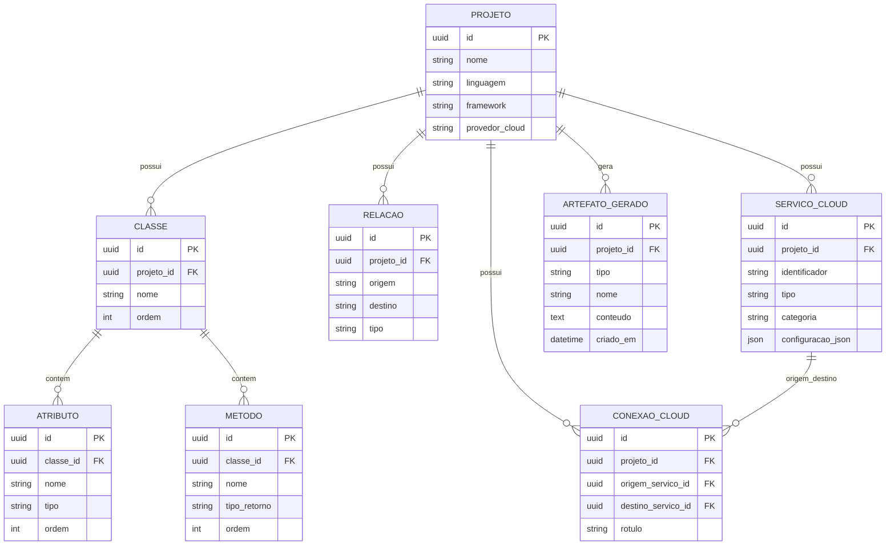

# Modelagem do Banco de Dados

## 1. Definir o banco de dados

Para a próxima etapa do projeto, o banco mais adequado é um banco relacional.

### Sugestão de tecnologia

- **Desenvolvimento local/testes:** H2
- **Produção:** PostgreSQL

### Por que usar banco relacional

- O sistema possui entidades com relacionamento claro entre si.
- Há necessidade de persistir projetos, classes, atributos, métodos, relações e artefatos.
- O modelo relacional facilita integridade, consultas e evolução futura.

### Entidades principais

- Projeto
- Classe
- Atributo
- Método
- Relação UML
- Serviço Cloud
- Conexão Cloud
- Artefato Gerado

## 2. Criar o diagrama das tabelas e relacionamentos

### Leitura do diagrama

- Um projeto pode ter várias classes.
- Uma classe pode ter vários atributos e métodos.
- Um projeto pode ter várias relações UML.
- Um projeto pode ter vários serviços cloud.
- Um projeto pode ter várias conexões cloud.
- Um projeto pode ter vários artefatos gerados.
